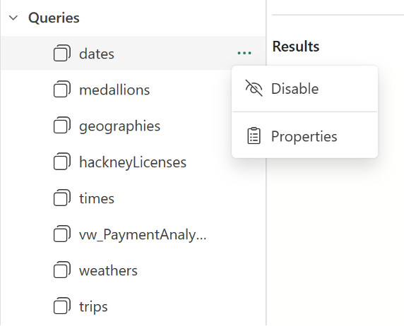
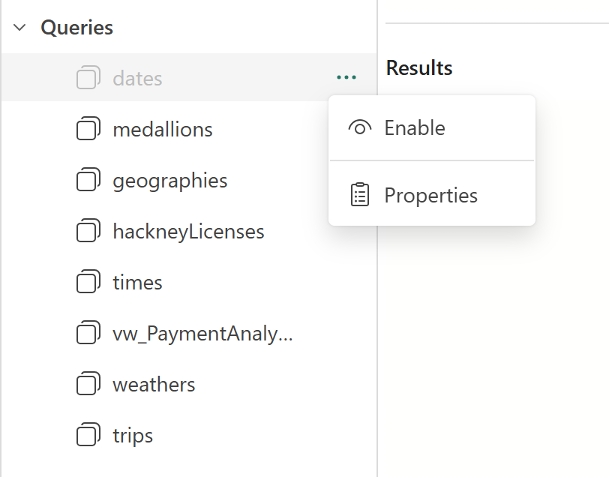

# Fabric API for GraphQL schema view and Schema explorer

> [!NOTE]
> Microsoft Fabric API for GraphQL is in preview.

The GraphQL schema, which is based on the GraphQL Schema Definition Language (SDL), defines the format of the data exposed in the API. It's an abstraction layer that provides flexibility to consumers while hiding backend implementation details. The schema is based on a collection of object types that contain fields.

## Schema view

You can access the schema view by selecting **Schema** in the lower left corner of the Data Development screen. The view shows a text-based version of the GraphQL SDL with generated types, fields, and operations.

The following image is an example of the schema view, including an extensive list of objects available in this schema.

> [!NOTE]
> The schema view is read-only. You can only modify objects in the Schema explorer.

:::image type="content" source="media/graphql-schema-view/schema-view.png" alt-text="Screenshot of the API schema view screen, which includes the Schema explorer in the left pane." lightbox="media/graphql-schema-view/schema-view.png":::

## Schema explorer

The **Schema explorer** is located in the pane on the left, and is also available when you use the editor in the query view. The explorer allows users to quickly visualize the available types and fields, as well as queries and mutations, defined in the API.

All the GraphQL types that are available from the objects you choose when you connect to a data source appear in the Schema explorer list. The types appear under the name of the data source from which they were derived. In the following image, you see the **SalesOrderDetail** type derived from the **SalesOrderDetail** table in the **AdventureWorks** SQL analytics endpoint.

:::image type="content" source="media/graphql-schema-view/schema-explorer-types.png" alt-text="Screenshot of the Schema explorer pane, showing the expanded list of types available under an example data source named SalesOrderDetail.":::

In addition to types, the Fabric API for GraphQL automatically generates queries and mutations for any new objects you choose to expose.

In our AdventureWorks example, expanding the list of queries shows the automatically generated queries for the data source.

:::image type="content" source="media/graphql-schema-view/schema-explorer-queries.png" alt-text="Screenshot of the Schema explorer pane, showing an expanded list of automatically generated queries.":::

To see the mutations automatically generated by the API, expand the mutations node in the **Schema explorer** tree.

:::image type="content" source="media/graphql-schema-view/schema-explorer-mutations.png" alt-text="Screenshot of the Schema explorer pane, showing an expanded list of automatically generated mutations.":::

## Modify objects using the Schema explorer

You can use the Schema explorer to modify objects after the API creates them for you. In the following example, we select the ellipsis next to the **SalesOrderDetail** type derived from our **AdventureWorks** database:

:::image type="content" source="media/graphql-schema-view/schema-explorer-modify-object.png" alt-text="Screenshot of the Schema explorer with the ellipsis selected, showing the available menu options.":::

The following options are available for Types:

- **Update schema** - Allows you to update the schema with new objects from the data source.
- **Rename** - Changes the name of the object. PLEASE NOTE: This change **only** affects the API schema, and has no effect on the original data source object from which it was derived.
- **Remove from schema** - Effectively deletes the object from the GraphQL schema so you can no longer reference it.
- **Manage relationships** - Takes you to the relationship management experience. For more information, see [Manage relationships in Fabric API for GraphQL](manage-relationships-graphql.md).
- **Properties** - Shows additional information about the object.

## Enabling and Disabling Queries and Mutations

The Enable/Disable feature for queries and mutations provides administrators and developers with granular control over API access and usage. You to selectively activate or deactivate specific queries and mutations within your GraphQL schema, giving you the ability to manage API capabilities dynamically without altering the underlying code or deploying changes.

Queries and Mutations in the Schema Explorer have two additional options for this:

- **Disable** - Prevents any requests from executing the query or mutation. If execution is attempted, an error will be returned. Once a query or a mutation is disabled, a schema reload takes place and Schema Explorer will show the query or mutation as grayed out.

- **Enable** - Enable a previously disabled query or mutation. Execution of the item is immediately available upon schema reload operation that takes place after selecting the Enable option.

Please note that queries or mutations auto-generated from stored procedures can only be deleted. Once deleted, they can be re-added using the Get Data button or the Update Schema options.

## Related content

- [Fabric API for GraphQL editor](api-graphql-editor.md)
