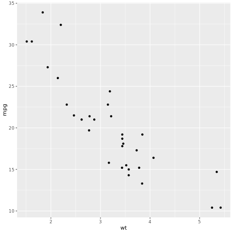
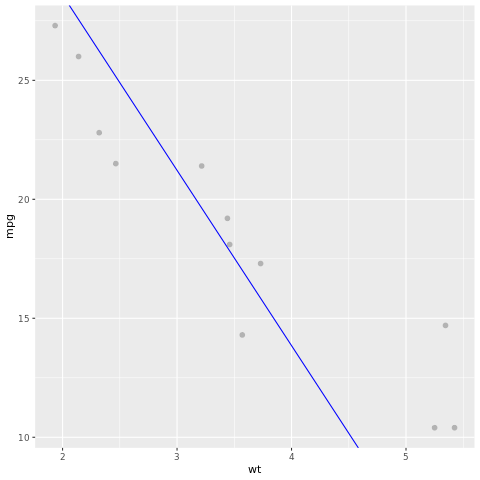

# Use Tidyverse

[Tidyverse](https://www.tidyverse.org/packages/) is a collection of R packages that data scientists commonly use in everyday data analyses. It includes packages for data import (`readr`), data visualization (`ggplot2`), data manipulation (`dplyr`, `tidyr`), functional programming (`purrr`), and model building (`tidymodels`) etc. The packages in `tidyverse` are designed to work together seamlessly and follow a consistent set of design principles.


[!INCLUDE [product-name](../includes/product-name.md)] distributes the latest stable version of `tidyverse` with every runtime release. Import and start using your familiar R packages.

## Prerequisites

[!INCLUDE [prerequisites](./includes/prerequisites.md)]

[!INCLUDE [r-prerequisites](./includes/r-notebook-prerequisites.md)]


## Load `tidyverse`

```R
# load tidyverse
library(tidyverse)
```

## Data import

`readr` is an R package that provides tools for reading rectangular data files such as CSV, TSV, and fixed-width files. `readr` provides a fast and friendly way to read rectangular data files such as providing functions `read_csv()` and `read_tsv()` for reading CSV and TSV files respectively.

Let's first create an R data.frame, write it to lakehouse using `readr::write_csv()` and read it back with `readr::read_csv()`.

> [!Note]
> To access Lakehouse files using `readr`, you need to use the *File API path*. In the Lakehouse explorer, right click on the file or folder that you want to access and copy its *File API path* from the contextual menu.


```R
# create an R data frame
set.seed(1)
stocks <- data.frame(
   time = as.Date('2009-01-01') + 0:9,
   X = rnorm(10, 20, 1),
   Y = rnorm(10, 20, 2),
   Z = rnorm(10, 20, 4)
 )
stocks
```

Then let's write the data to lakehouse using the *File API path*.

```R
# write data to lakehouse using the File API path
temp_csv_api <- "/lakehouse/default/Files/stocks.csv"
readr::write_csv(stocks,temp_csv_api)
```

Read the data from lakehouse.

```R
# read data from lakehouse using the File API path
stocks_readr <- readr::read_csv(temp_csv_api)

# show the content of the R date.frame
head(stocks_readr)
```

## Data tidying

`tidyr` is an R package that provides tools for working with messy data. The main functions in `tidyr` are designed to help you reshape data into a tidy format. Tidy data has a specific structure where each variable is a column and each observation is a row, which makes it easier to work with data in R and other tools.

For example, the `gather()` function in `tidyr` can be used to convert wide data into long data. Here's an example:

```R
# convert the stock data into longer data
library(tidyr)
stocksL <- gather(data = stocks, key = stock, value = price, X, Y, Z)
stocksL
```

## Functional programming

`purrr` is an R package that enhances R’s functional programming toolkit by providing a complete and consistent set of tools for working with functions and vectors. The best place to start with `purrr` is the family of `map()` functions that allow you to replace many for loops with code that is both more succinct and easier to read. Here’s an example of using `map()` to apply a function to each element of a list:

```R
# double the stock values using purrr
library(purrr)
stocks_double = map(stocks %>% select_if(is.numeric), ~.x*2)
stocks_double
```

## Data manipulation

`dplyr` is an R package that provides a consistent set of verbs that help you solve the most common data manipulation problems, such as selecting variables based on the names, picking cases based on the values, reducing multiple values down to a single summary, and changing the ordering of the rows etc. Here are some examples:

```R
#  pick variables based on their names using select() 
stocks_value <- stocks %>% select(X:Z)
stocks_value
```

```R
# pick cases based on their values using filter()
filter(stocks_value, X >20)
```

```R
# add new variables that are functions of existing variables using mutate()
library(lubridate)

stocks_wday <- stocks %>% 
    select(time:Z) %>%
    mutate(
        weekday = wday(time)
    )

stocks_wday
```

```R
# change the ordering of the rows using arrange()
arrange(stocks_wday, weekday)

```

```R
# reduce multiple values down to a single summary using summarise()
stocks_wday %>% 
    group_by(weekday) %>%
    summarize(meanX = mean(X), n= n())
```

## Data visualization

`ggplot2` is an R package for declaratively creating graphics, based on The Grammar of Graphics. You provide the data, tell `ggplot2` how to map variables to aesthetics, what graphical primitives to use, and it takes care of the details. Here are some examples:


``` R
# draw a chart with points and lines all in one

ggplot(stocksL, aes(x=time, y=price, colour = stock)) + 
  geom_point()+
  geom_line()

```


```R
# draw a boxplot

ggplot(stocksL, aes(x=time, y=price, colour = stock)) + 
  geom_boxplot()
```


## Model building

The `tidymodels` framework is a collection of packages for modeling and machine learning using `tidyverse` principles. It covers a list of core packages for a wide variety of model building tasks, such as `rsample` for train/test dataset sample splitting, `parsnip` for model specification, `recipes` for data preprocessing, `workflows` for modeling workflows, `tune` for hyperparameters tuning, `yardstick` for model evaluation, `broom` for tiding model outputs, and `dials` for managing tuning parameters. You can learn more about the packages by visiting [tidymodels website](https://www.tidymodels.org/packages/). Here's an example of building a linear regression model to predict the miles per gallon (mpg) of a car based on its weight (wt):

```R
# look at the relationship between the miles per gallon (mpg) of a car and its weight (wt)
ggplot(mtcars, aes(wt,mpg))+
geom_point()
```



From the scatterplot, the relationship looks approximately linear and the variance looks constant. Let's try to model this using linear regression.


```R
library(tidymodels)

# split test and training dataset
set.seed(123)
split <- initial_split(mtcars, prop = 0.7, strata = "cyl")
train <- training(split)
test <- testing(split)


# config the linear regression model
lm_spec <- linear_reg() %>%
  set_engine("lm") %>%
  set_mode("regression")

# build the model
lm_fit <- lm_spec %>%
  fit(mpg ~ wt, data = train)

tidy(lm_fit)
```

Apply the linear regression model to predict on test dataset.

``` R
# using the lm model to predict on test dataset
predictions <- predict(lm_fit, test)
predictions
```

Let's take a look at the model result. We can draw the model as a line chart and the test ground truth data as points on the same chart. The model looks good.

``` R
# draw the model as a line chart and the test data groundtruth as points 
lm_aug <- augment(lm_fit, test) 
ggplot(lm_aug, aes(x = wt, y = mpg)) +
  geom_point(size=2,color="grey70") +
  geom_abline(intercept = lm_fit$fit$coefficients[1], slope = lm_fit$fit$coefficients[2], color = "blue")
```




## Next steps

- [How to use SparkR](./r-use-sparkr.md)
- [How to use sparklyr](./r-use-sparklyr.md)
- [R library management](./r-library-management.md)
- [Visualize data in R](./r-visualization.md)
- [Tutorial: avocado price prediction](./r-avocado.md)
- [Tutorial: flight delay prediction](./r-flight-delay.md)
