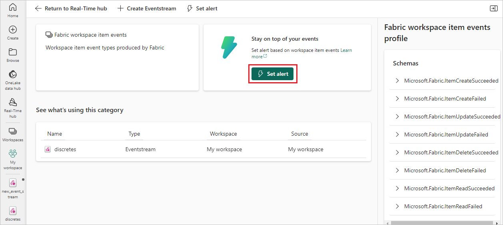
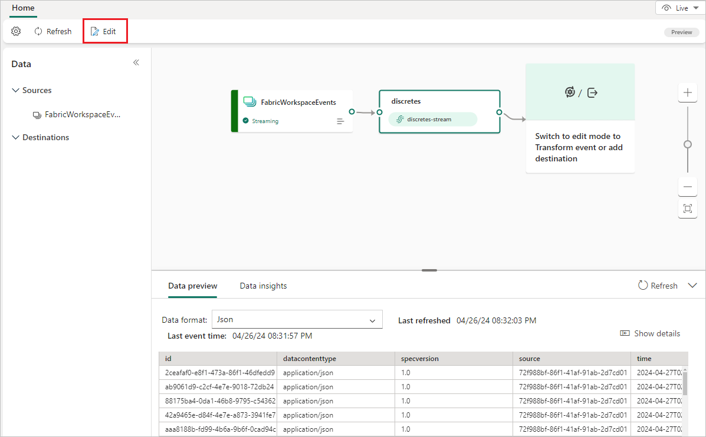

# Add Azure Blob Storage event source to an eventstream

This article shows you how to add an Azure Blob Storage event source to an eventstream. For more information about creating eventstreams for discrete events, see [Create eventstreams for discrete events](create-eventstreams-discrete events.md).

Microsoft Fabric event streams supports the following Blob Storage event types:

|Event name|Description|
|-------|------------|
|Microsoft.Storage.BlobCreated|Triggered when a blob is created or replaced.|
|Microsoft.Storage.BlobDeleted                    |Triggered when a blob is deleted.|
|Microsoft.Storage.BlobRenamed                    |Triggered when a blob is renamed.|
|Microsoft.Storage.BlobTierChanged                |Triggered when the blob access tier is changed.|
|Microsoft.Storage.DirectoryCreated               |Triggered when a directory is created.|
|Microsoft.Storage.DirectoryRenamed               |Triggered when a directory is renamed.|
|Microsoft.Storage.AsyncOperationInitiated        |Triggered when an operation involving moving or copying data from the archive to hot or cool tiers is initiated.|
|Microsoft.Storage.DirectoryDeleted               |Triggered when a directory is deleted.|
|Microsoft.Storage.BlobInventoryPolicyCompleted   |Triggered when the inventory run completes for a rule that defines an inventory policy.|
|Microsoft.Storage.LifecyclePolicyCompleted       |Triggered when the actions defined by a lifecycle management policy are done.|

For more details about available event types, see [Azure Blob Storage as Event Grid source](/azure/event-grid/event-schema-blob-storage).

## Prerequisites

- Access to the Fabric **premium workspace** with **Contributor** or higher permissions.
- Access to an Azure storage account.

## Add Azure Blob Storage events as source

1. Select **Eventstream** to create a new eventstream. Make sure the **Enhanced Capabilities (preview)** option is enabled.

   

1. On the next screen, select **Add external source**.

   

## Configure and connect to Azure Blob Storage events

[!INCLUDE [azure-blob-storage-connector](includes/azure-blob-storage-source-connector.md)]

Once the connection is created, you can see the Azure Blob Storage event source added to your eventstream in **Edit mode**. Select **Publish** to publish the eventstream and capture the workspace events.

Before you proceed with event transformation or routing, make sure you successfully created and captured the workspace events in the eventstream and published the eventstream. Once it's published, you can find the default stream representing the captured events in **Real-Time hub** on the **Fabric events** tab.

Select **Edit** on the Eventstream ribbon to enter **Edit mode**, where you can add operations to transform the Fabric workspace events or route them to a destination such as Lakehouse.

## Related content

- [Add Fabric workspace item events to an eventstream](add-source-fabric-workspace.md)
- [Create eventstreams for discrete events](create-eventstreams-discrete-events.md)
