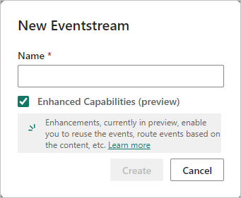
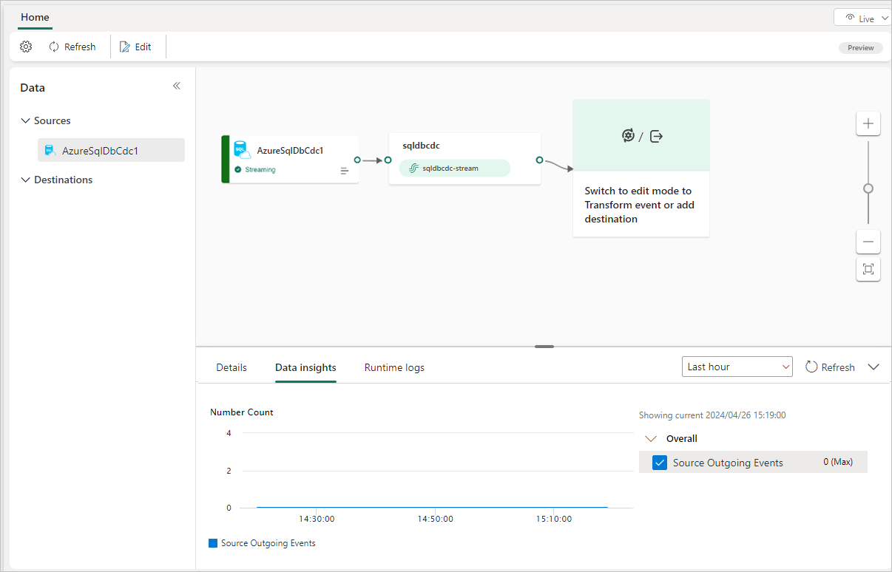

# Add Azure SQL Database CDC source to an eventstream (preview)

This article shows you how to add an Azure SQL Database Change Data Capture (CDC) source to an eventstream.

The Azure SQL Database CDC source connector for Microsoft Fabric event streams allows you to capture a snapshot of the current data in an Azure SQL database. The connector then monitors and records any future row-level changes to this data. Once the changes are captured in the eventstream, you can process this CDC data in real-time and send it to different destinations within Fabric for further processing or analysis.

[!INCLUDE [enhanced-capabilities-preview-note](./includes/enhanced-capabilities-preview-note.md)]

## Prerequisites

- Access to the Fabric **premium workspace** with **Contributor** or higher permissions.
- A running Azure SQL server with an Azure SQL database.
- Your Azure SQL database must be publicly accessible and not be behind a firewall or secured in a virtual network.
- Membership in the **sysadmin** fixed server role for the SQL Server, and **db_owner** role on the database.
- CDC enabled on your Azure SQL database by running the stored procedure `sys.sp_cdc_enable_db`. For details, see [Enable and disable change data capture](/sql/relational-databases/track-changes/enable-and-disable-change-data-capture-sql-server).

>[!NOTE]
> Mirroring shouldn't be enabled in your database.

## Add Azure SQL Database CDC as a source

1. Select **Eventstream** to create a new eventstream. Make sure the **Enhanced Capabilities (preview)** option is enabled.

   

1. On the next screen, select **Add external source**.

   

## Configure and connect to Azure SQL Database CDC

[!INCLUDE [azure-sql-database-cdc-connector](./includes/azure-sql-database-cdc-source-connector.md)]

You can see the Azure SQL Database (CDC) source added to your eventstream in **Edit mode**.

:::image type="content" source="media/add-source-azure-sql-database-change-data-capture/edit-view.png" alt-text="Screenshot of streaming Azure SQL Database CDC source in Edit view." lightbox="media/add-source-azure-sql-database-change-data-capture/edit-view.png":::

To implement this newly added Azure SQL Database CDC source, select **Publish**. After you complete these steps, your Azure SQL Database CDC source is available for visualization in the **Live view**.

## Related content

Other connectors:

- [Amazon Kinesis Data Streams](add-source-amazon-kinesis-data-streams.md)
- [Azure Cosmos DB](add-source-azure-cosmos-db-change-data-capture.md)
- [Azure Event Hubs](add-source-azure-event-hubs.md)
- [Azure IoT Hub](add-source-azure-iot-hub.md)
- [Confluent Kafka](add-source-confluent-kafka.md)
- [Custom endpoint](add-source-custom-app.md)
- [Google Cloud Pub/Sub](add-source-google-cloud-pub-sub.md) 
- [MySQL Database CDC](add-source-mysql-database-change-data-capture.md)
- [PostgreSQL Database CDC](add-source-postgresql-database-change-data-capture.md)
- [Sample data](add-source-sample-data.md)
- [Azure Blob Storage events](add-source-azure-blob-storage.md)
- [Fabric workspace event](add-source-fabric-workspace.md)