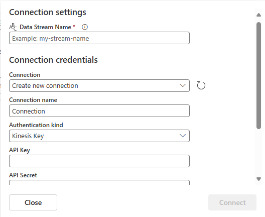
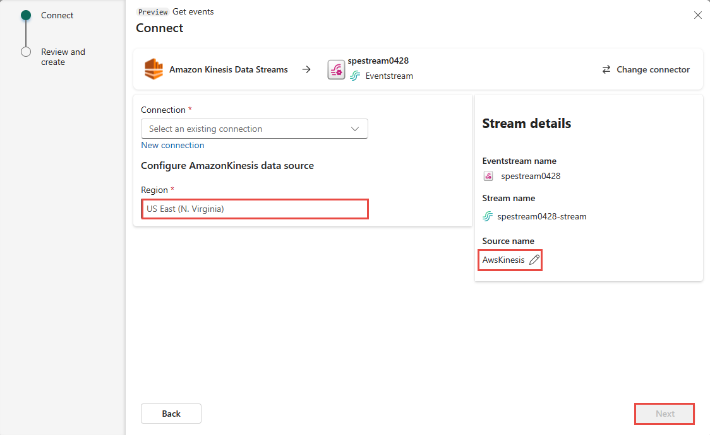

1. On the **Select a data source** screen, select **Kinesis Data Streams**.

   

1. On the **Connect** screen, enter the **Connection settings** and **Connection credentials** for your AWS Kinesis Data Stream.

   

   - For **Data Stream Name**, enter the data stream name from Amazon Kinesis as shown in the following example.

     

   - For **Connection name**, enter a name for this cloud connection.

   - For **API Key** and **API Secret**, enter the credentials you use to access your Kinesis Data Stream. Go to the Amazon IAM console and select **Security credentials**. Copy an **Access Key ID** from the **Access keys** screen and paste it into **API Key** and **API Secret**.

     

   - For **Source name**, enter a source name for this new eventstream source.

1. Scroll down, and under **Configure Amazon Kinesis data source**, enter a **Region** for the data source. You can find the Amazon region code such as **us-west-2** from the Kinesis **Data stream summary**.

   

1. Select **Connect**.

1. Select **Next**. On the **Review and create** screen, review the summary, and then select **Add**.

