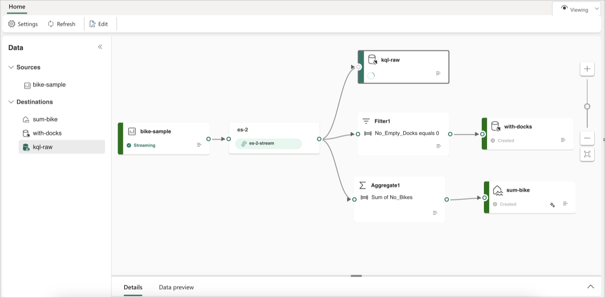

# Route data streams based on content in Fabric event streams (preview)

This article shows you how to route events based on content in Microsoft Fabric event streams.

You can now use the no-code editor in the Fabric event streams main canvas to create complex stream processing logic without writing any code. This feature lets you tailor, transform, and manage your data streams more easily. After setting your stream processing operations, you can smoothly send your data streams to different destinations according to the specific schema and stream data.

[!INCLUDE [enhanced-capabilities-preview-note](./includes/enhanced-capabilities-preview-note.md)]

## Supported operations

Here's the list of operations supported for real-time data processing:

- **Aggregate**: Support SUM, AVG, MIN, and MAX functions that perform calculations on a column of values, returning a single result.

- **Expand**: Expand an array value and create a new row for each value within an array.

- **Filter**: Select or filter specific rows from the data stream based on a condition.

- **Group by**: Aggregate all event data within a certain time window, with the option to group one or more columns.

- **Manage Fields**: Add, remove, or change data type of a field or column of your data streams.

- **Union**: Connect two or more data streams with shared fields of the same name and data type into one data stream. Fields that don't match are dropped.

## Supported destinations

The supported destinations are:

- **Lakehouse**: This destination provides you with the ability to transform your real-time events prior to ingestion into your lakehouse. Real-time events convert into Delta Lake format and then store in the designated lakehouse tables. This destination helps with data warehousing scenarios.

- **KQL Database**: This destination enables you to ingest your real-time event data into KQL Database, where you can use the powerful Kusto Query Language (KQL) to query and analyze the data. With the data in KQL Database, you can gain deeper insights into your event data and create rich reports and dashboards.

- **Reflex**: This destination lets you directly connect your real-time event data to a Reflex. Reflex is a type of intelligent agent that contains all the information necessary to connect to data, monitor conditions, and act. When the data reaches certain thresholds or matches other patterns, Reflex automatically takes appropriate action such as alerting users or kicking off Power Automate workflows.

- **Custom App:** With this destination, you can easily route your real-time events to a custom application. This destination lets you connect your own applications to the eventstream and consume the event data in real time. It's useful when you want to egress real-time data to an external system outside Microsoft Fabric.

- **Stream**: This destination represents the default raw eventstream transformed by a series of operations, also called a derived stream. Once created, you can view the stream from the Real-Time hub.

The following example shows how three distinct Fabric eventstream destinations can serve separate functions for a single data stream source. One KQL database is designated for storing raw data, a second KQL database is for retaining filtered data streams, and the Lakehouse is used for storing aggregated values.

To transform and route your data stream based on content, follow the steps at [Edit and publish an eventstream](edit-publish.md) and start designing stream processing logics for your data stream.

## Related content

- [New capabilities in Microsoft Fabric event streams](overview.md)
- [Edit and publish an eventstream](edit-publish.md)
- [Create default and derived eventstreams](create-default-derived-streams.md)
