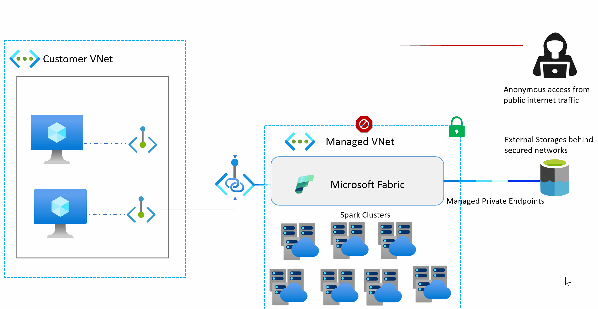
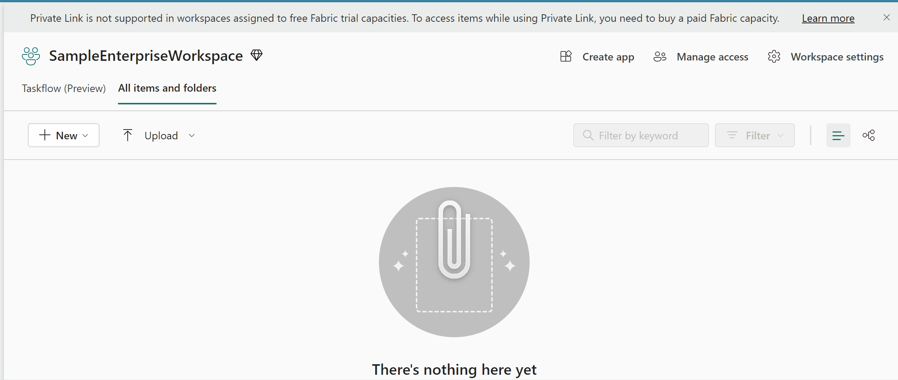
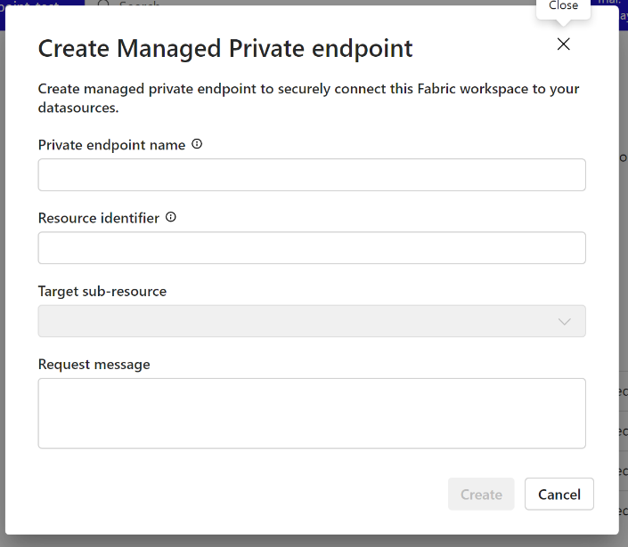
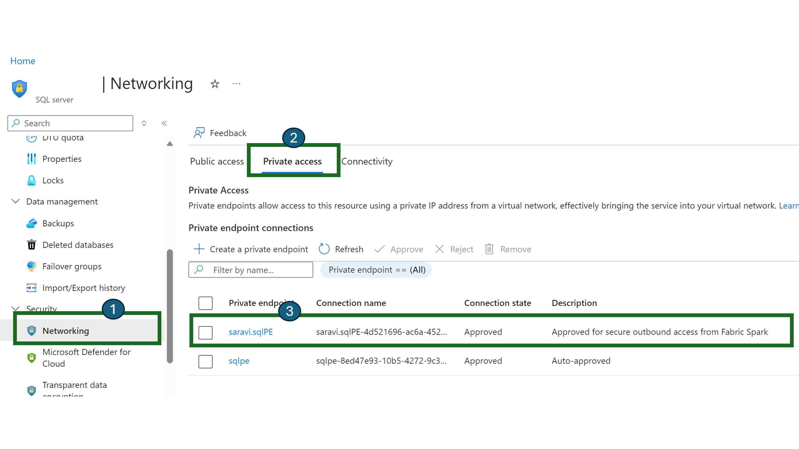
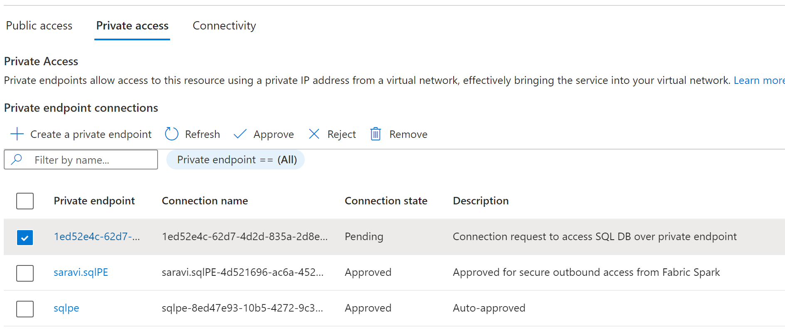
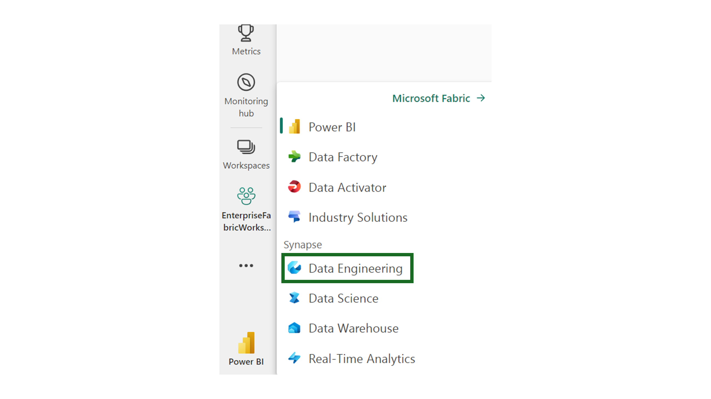

# What are Managed Virtual Networks?

Managed virtual networks are virtual networks that are created and managed by Microsoft Fabric for each Fabric workspace. Managed virtual networks provide network isolation for Fabric Spark workloads, meaning that the compute clusters are deployed in a dedicated network and are no longer part of the shared virtual network.

Managed virtual networks also enable network security features such as managed private endpoints, and private link support for Data Engineering and Data Science items in Microsoft Fabric that use Apache Spark.

The following image illustrates ......

Fabric workspaces that are provisioned with a dedicated virtual network provide value in four ways:

* With a managed virtual network you get complete network isolation for the Spark clusters running your Spark jobs (which allow users to run arbitrary user code) while offloading the burden of managing the virtual network to Microsoft Fabric.

* You don't need to create a subnet for the Spark clusters based on peak load, as this is managed for you by Microsoft Fabric.

* A managed virtual network for your workspace, along with managed private endpoints, allows you to access data sources that are behind firewalls or otherwise blocked from public access.

## How to enable managed virtual networks for a Fabric workspace

Managed virtual networks are provisioned for a Fabric workspace when either of the following cases occurs. 

* Managed private endpoints are added to a workspace. Workspace admins can create and delete managed private endpoint connections from the workspace settings of a Fabric Workspace. See [How to create a managed private endpoint in a Fabric workspace for instructions](#how-to-create-a-managed-private-endpoint-in-a-fabric-workspace).

* Azure Private Link is enabled and a Spark job is run in a Fabric Workspace. Fabric admins can enable the **[Azure Private Link](../admin/service-admin-portal-advanced-networking.md)** tenant setting in the Admin portal of their Microsoft Fabric tenant. See [Set up and use secure private endpoints](./security-private-links-use.md).

### How to create a managed private endpoint in a Fabric workspace

1. Open the **Workspace settings**.
1. Select the **Network Security tab**.
1. Select the “**Create**” option in the Managed Private Endpoints section.
1. Specify the **Private Endpoint Name**, Add the **Resource Identifier** for the Azure resource that you are trying to connect to.
1. Select the **Target Sub Resource** from the list of options.
1. Specify the business justification for the Data Source administrator who needs to approve to your private endpoint request as part of the **Request Message**.
1. Select **Submit**.

The following animation illustrates the process of enabling a managed virtual network for a Fabric workspace.

:::image type="content" source="./media/security-managed-private-endpoints/image2.gif" alt-text="Animated illustration of how to created a managed private endpoint in a Fabric workspace.}":::

    Once you have enabled the Private Link setting, running the first Spark job (Notebook or Spark job definition) or performing a Lakehouse operation (for example, Load to Table, or a table maintenance operation such as Optimize or Vacuum) will result in the creation of a managed virtual network for the workspace. 

    > [!NOTE]
    > The managed virtual network is provisioned automatically as part of the job submission step for the first Spark Job in the workspace. Once the managed virtual network has been provisioned, the starter pools (default Compute option) for Spark are disabled, as these are pre-warmed clusters hosted in a shared virtual network. Spark jobs will run on custom pools created on-demand at the time of job submission within the dedicated managed virtual network of the workspace.

### Known Limitations

- Starter Pools are not supported in workspaces that are enabled with Managed Vnets (i.e workspaces which have managed private endpoints or workspaces which are in a Fabric tenant enabled with Private Link setting and have run a Spark job).

- Managed Private Endpoints are only supported for Fabric Trial and Fabric Capacities F64 or higher.

- Workspaces which have at least one Managed Private Endpoint can only be migrated to F64 or greater Fabric Capacity SKU.

- Data Science items Models and Experiments are not supported for Tenants which are enabled with Private Links.

- Lakehouse table maintenance operations are not supported for workspaces enabled with Managed VNets.

These limitations may affect your use cases and workflows, so please consider them before enabling the Private Link setting for your tenant.

Learn more about Managed Private Endpoints 

Learn more about Private Links 

Managed Private Endpoints for Microsoft Fabric

A feature that allows secure and private access to data sources from Fabric Spark workloads

# What are Managed Private Endpoints?

* Managed Private Endpoints are private endpoints that workspace admins can create to connect to data sources that are behind a firewall or that are blocked from accessing from the public internet.
* Managed Private Endpoints allow Fabric Spark workloads to securely access data sources without exposing them to the public network or requiring complex network configurations.
* The private endpoints provide a secure way to connect and access the data from these Data Sources through Fabric Spark items like Notebooks and Spark Job Definitions. 
* Managed Private Endpoints are created and managed by Microsoft Fabric, and the user only needs to specify the resource id of the data source, target sub-resource and the reason they would want to gain access to
* Managed Private Endpoints support various data sources, such as Azure Storage, Azure SQL Database, Azure Synapse Analytics, Azure Cosmos DB, Application gateway, Azure Keyvault and many more. 

  

# How to Create Managed Private Endpoints?

Users with admin permissions to a Microsoft Fabric workspace can create, view and delete Managed Private Endpoints from the Fabric portal through the workspace settings. 

* The user can also monitor the status and the approval process of the Managed Private Endpoints from the Network security section of the Workspace settings.
* The user can access the data sources using the private endpoint name from the Fabric Spark workloads.

Create a Fabric Workspace  

Navigate to the Workspace Settings  

 

Navigate to the “Network Security” tab  

 

 

Click on Create  option in the Managed Private Endpoint section 

Specify the name for the private endpoint , and copy the resource identifier for the Azure resource. (This can be found in the properties tab on the Azure Portal Page) 

Click on create  

Once the Managed Private Endpoint has been provisioned, the Activation status will be changing to a Succeeded state 

 

8. Once the managed private endpoint has been provisioned, the request for the private endpoint access would also have been sent to the Data Source.
1. Data Source admins would be notified on their Azure portal resource pages for their Data Sources, where they would see a pending access request, with the request message.
1. If we take the example of SQL server, users could navigate to the Azure Portal -> Search for the “SQL Server” resource. 
1. On the Resource page -> Select the Networking menu -> Select Private Access 

   

   Data source administrators should be able to view the active private endpoint connections and new connection requests. 

   

1. Admins can either “Approve” or “Reject” by providing a business justification. 

   

   

18. Once the request has been “Approved” or “Rejected” by the data source administrator, the status is updated in the Fabric workspace settings page on refresh. 

    

1. Once the status has been approved, the end point could be used in the Notebook or Spark Job Definitions to access the data stored in the data source from Fabric workspace.

How to use these Managed Private Endpoints in Microsoft Fabric

Microsoft Fabric notebooks support seamless interaction with Data sources behind secured networks using Managed Private Endpoints for data exploration and processing. Within a notebook, users can quickly read data from their protected data sources—and write data back to—their Lakehouses in a variety of file formats. This guide provides code samples to help you get started in your own notebooks to access data from data sources like SQL DB through managed private endpoints. 

## Prerequisites

1. Access to the data source, in this example lets look at Azure SQL Server  and Azure SQL Database 
1. Sign into Microsoft Fabric and Azure portal
1. Navigate to the Azure SQL Server’s resource page on the Azure Portal and select the Properties menu -> and copy the Resource ID for the SQL Server that you would like to connect from Microsoft Fabric
1. Using the steps listed in **How to Create Managed Private Endpoints in Microsoft Fabric,** create the managed private endpoint from the Fabric Network Security settings page. 
1. Once the data source administrator of the SQL server has approved the new private endpoint connection request, you should be able to use the newly created Managed Private Endpoint. 

## Connect to the Data Source from Notebooks

1. In the Microsoft Fabric workspace, Use the experience switcher on the left side of your home page to switch to the Synapse Data Engineering experience

   

1. Click on create and create a new Notebook 
1. Now in the notebook, by specifying the name of the SQL database , and its connection properties you could connect through the managed private endpoint connection that’s been setup to read the tables in the database and write them to your Lakehouse in Microsoft Fabric.
1. `serverName = "<server_name>.database.windows.net"database = "<database_name>"dbPort = 1433dbUserName = "<username>"dbPassword = “<db password> or reference based on Keyvault>”from pyspark.sql import SparkSessionspark = SparkSession.builder \    .appName("Example") \    .config("spark.jars.packages", "com.microsoft.azure:azure-sqldb-spark:1.0.2") \    .config("spark.sql.catalogImplementation", "com.microsoft.azure.synapse.spark") \    .config("spark.sql.catalog.testDB", "com.microsoft.azure.synapse.spark") \    .config("spark.sql.catalog.testDB.spark.synapse.linkedServiceName", "AzureSqlDatabase") \ .config("spark.sql.catalog.testDB.spark.synapse.linkedServiceName.connectionString", f"jdbc:sqlserver://{serverName}:{dbPort};database={database};user={dbUserName};password={dbPassword}") \ .getOrCreate()    jdbcURL = "jdbc:sqlserver://{0}:{1};database={2}".format(serverName,dbPort,database)connection = {"user":dbUserName,"password":dbPassword,"driver": "com.microsoft.sqlserver.jdbc.SQLServerDriver"}serverName = "<server_name>.database.windows.net"database = "<database_name>"dbPort = 1433dbUserName = "<username>"dbPassword = “<db password> or reference based on Keyvault>”from pyspark.sql import SparkSessionspark = SparkSession.builder \    .appName("Example") \    .config("spark.jars.packages", "com.microsoft.azure:azure-sqldb-spark:1.0.2") \    .config("spark.sql.catalogImplementation", "com.microsoft.azure.synapse.spark") \    .config("spark.sql.catalog.testDB", "com.microsoft.azure.synapse.spark") \    .config("spark.sql.catalog.testDB.spark.synapse.linkedServiceName", "AzureSqlDatabase") \ .config("spark.sql.catalog.testDB.spark.synapse.linkedServiceName.connectionString", f"jdbc:sqlserver://{serverName}:{dbPort};database={database};user={dbUserName};password={dbPassword}") \ .getOrCreate()    jdbcURL = "jdbc:sqlserver://{0}:{1};database={2}".format(serverName,dbPort,database)connection = {"user":dbUserName,"password":dbPassword,"driver": "com.microsoft.sqlserver.jdbc.SQLServerDriver"}`The following pyspark code shows how to connect to a SQL database 

`df = spark.read.jdbc(url=jdbcURL, table = "dbo.Employee", properties=connection)df.show()display(df)# Write the dataframe as a delta table in your lakehousedf.write.mode("overwrite").format("delta").saveAsTable("Employee")# You can also specify a custom path for the table location# df.write.mode("overwrite").format("delta").option("path", "abfss://yourlakehouse.dfs.core.windows.net/Employee").saveAsTable("Employee")df = spark.read.jdbc(url=jdbcURL, table = "dbo.Employee", properties=connection)df.show()display(df)# Write the dataframe as a delta table in your lakehousedf.write.mode("overwrite").format("delta").saveAsTable("Employee")# You can also specify a custom path for the table location# df.write.mode("overwrite").format("delta").option("path", "abfss://yourlakehouse.dfs.core.windows.net/Employee").saveAsTable("Employee")`

6. Now that the connection has been established, next step is to create a data frame to read the table in the SQL Database 

Supported Data Sources for Managed Private Endpoints in Microsoft Fabric

Microsoft Fabric supports over 25 data sources to connect using Managed Private Endpoints. Users would have to specify the Resource Identifier which can be found in the “Properties” settings page of their data source on Azure portal. 

- Cognitive Services: /subscriptions/{subscription-id}/resourceGroups/{resource-group-name}/providers/Microsoft.CognitiveServices/accounts/{resource-name}

- Azure Databricks: /subscriptions/{subscription-id}/resourceGroups/{resource-group-name}/providers/Microsoft.Databricks/workspaces/{workspace-name}

- Azure Database for MariaDB: /subscriptions/{subscription-id}/resourceGroups/{resource-group-name}/providers/Microsoft.DBforMariaDB/servers/{server-name}

- Azure Database for MySQL: /subscriptions/{subscription-id}/resourceGroups/{resource-group-name}/providers/Microsoft.DBforMySQL/servers/{server-name}

- Azure Database for PostgreSQL: /subscriptions/{subscription-id}/resourceGroups/{resource-group-name}/providers/Microsoft.DBforPostgreSQL/servers/{server-name}

- Azure Cosmos DB for MongoDB: /subscriptions/{subscription-id}/resourceGroups/{resource-group-name}/providers/Microsoft.DocumentDB/databaseAccounts/{account-name}

- Azure Cosmos DB for NoSQL: /subscriptions/{subscription-id}/resourceGroups/{resource-group-name}/providers/Microsoft.DocumentDB/databaseAccounts/{account-name}

- Azure Monitor Private Link Scopes: /subscriptions/{subscription-id}/resourceGroups/{resource-group-name}/providers/Microsoft.Insights/privateLinkScopes/{scope-name}

- Azure Key Vault: /subscriptions/{subscription-id}/resourceGroups/{resource-group-name}/providers/Microsoft.KeyVault/vaults/{vault-name}

- Azure Data Explorer (Kusto): /subscriptions/{subscription-id}/resourceGroups/{resource-group-name}/providers/Microsoft.Kusto/clusters/{cluster-name}

- Azure Machine Learning: /subscriptions/{subscription-id}/resourceGroups/{resource-group-name}/providers/Microsoft.MachineLearningServices/workspaces/{workspace-name}

- Application Gateway: /subscriptions/{subscription-id}/resourceGroups/{resource-group-name}/providers/Microsoft.Network/applicationGateways/{gateway-name}

- Private Link Service: /subscriptions/{subscription-id}/resourceGroups/{resource-group-name}/providers/Microsoft.Network/privateLinkServices/{service-name}

- Microsoft Purview: /subscriptions/{subscription-id}/resourceGroups/{resource-group-name}/providers/Microsoft.Purview/accounts/{account-name}

- Azure Search: /subscriptions/{subscription-id}/resourceGroups/{resource-group-name}/providers/Microsoft.Search/searchServices/{service-name}

- Azure SQL Database: /subscriptions/{subscription-id}/resourceGroups/{resource-group-name}/providers/Microsoft.Sql/servers/{server-name}

- Azure SQL Database (Managed Instance): /subscriptions/{subscription-id}/resourceGroups/{resource-group-name}/providers/Microsoft.Sql/managedInstances/{instance-name}

- Azure Blob Storage: /subscriptions/{subscription-id}/resourceGroups/{resource-group-name}/providers/Microsoft.Storage/storageAccounts/{storage-account-name}

- Azure Data Lake Storage Gen2: /subscriptions/{subscription-id}/resourceGroups/{resource-group-name}/providers/Microsoft.Storage/storageAccounts/{storage-account-name}

- Azure File Storage: /subscriptions/{subscription-id}/resourceGroups/{resource-group-name}/providers/Microsoft.Storage/storageAccounts/{storage-account-name}

- Azure Queue Storage: /subscriptions/{subscription-id}/resourceGroups/{resource-group-name}/providers/Microsoft.Storage/storageAccounts/{storage-account-name}

- Azure Table Storage: /subscriptions/{subscription-id}/resourceGroups/{resource-group-name}/providers/Microsoft.Storage/storageAccounts/{storage-account-name}

- Azure Synapse Analytics: /subscriptions/{subscription-id}/resourceGroups/{resource-group-name}/providers/Microsoft.Synapse/workspaces/{workspace-name}

- Azure Synapse Analytics (Artifacts): /subscriptions/{subscription-id}/resourceGroups/{resource-group-name}/providers/Microsoft.Synapse/workspaces/{workspace-name}

- Azure Functions: /subscriptions/{subscription-id}/resourceGroups/{resource-group-name}/providers/Microsoft.Web/sites/{function-app-name}
